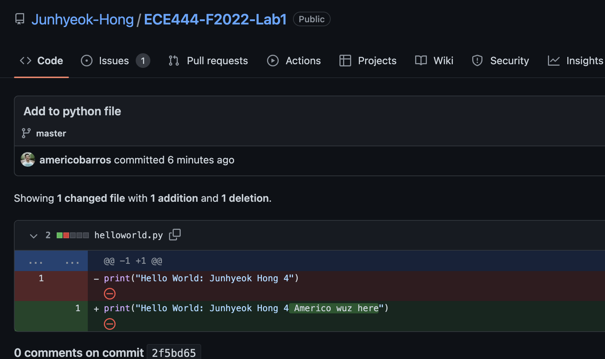
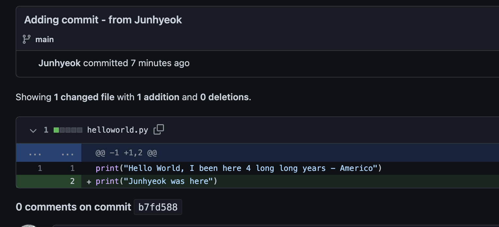
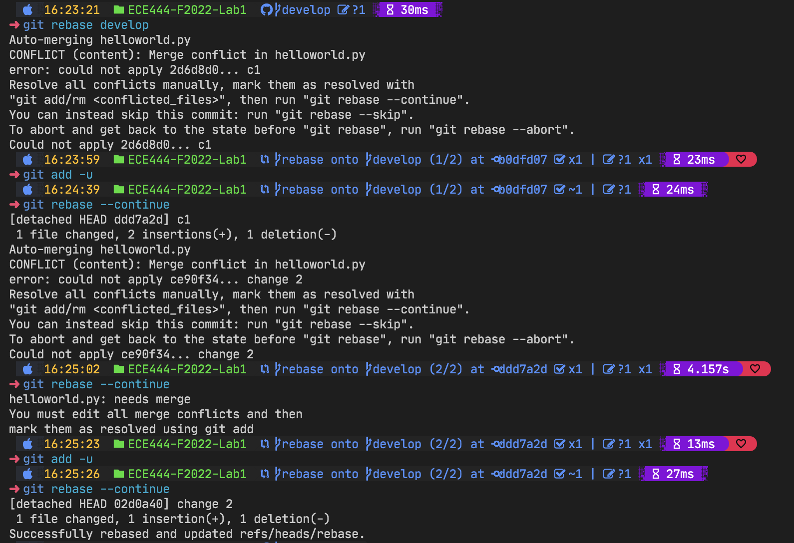
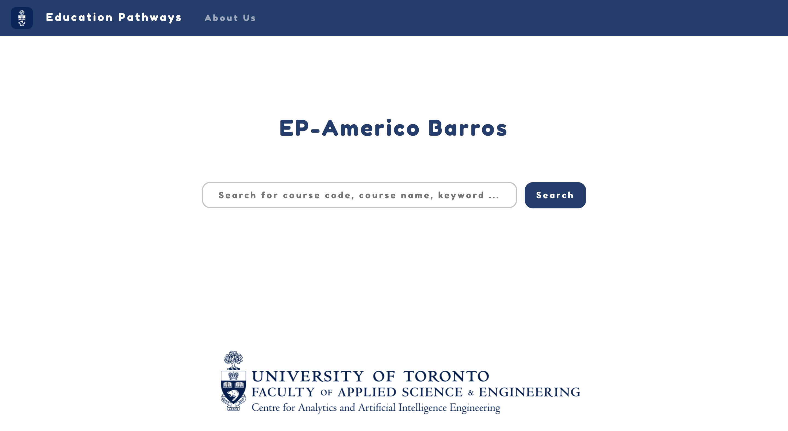
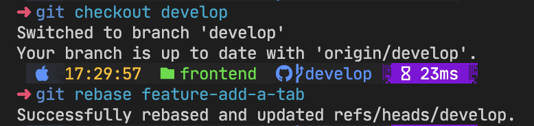
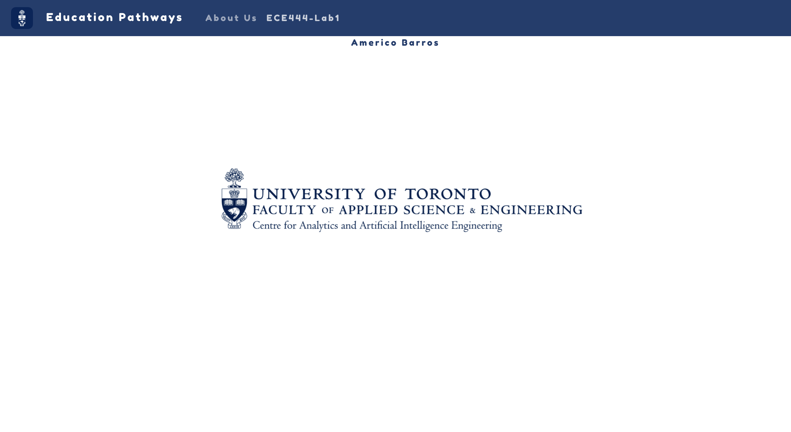

# ECE444-F2022-Lab1
## Americo
### Activity 1

### Activity 2

### Activity 3

### Activity 4
https://github.com/Junhyeok-Hong/ECE444-F2022-Lab1

### Activity 5
On branch 'rebase', the history is now c3 -> c4 -> c1 -> c2

### Activity 6
https://github.com/americobarros/ECE444-F2022-EP
### Activity 7

### Activity 8

